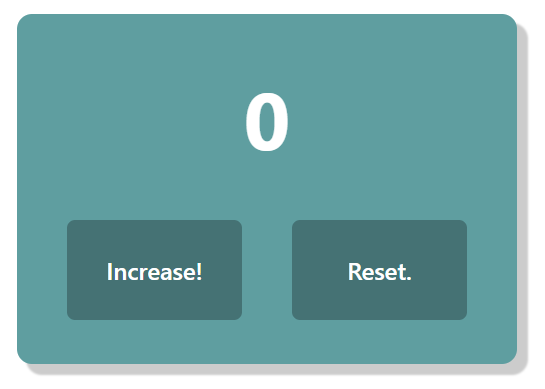

# Счетчик (Counter App)

Простое приложение-счётчик с двумя кнопками: увеличение и уменьшение значения.
## 🔧 Основные функции

Приложение отображает:
- Заголовок с текущим числом
- Две кнопки:
  - Увеличить
  - Уменьшить

## 💻 Использованные технологии

- **React** — для построения интерактивного пользовательского интерфейса
- **Vite** — для быстрой сборки и запуска локального сервера
- **JavaScript (JSX)** — для логики работы приложения
- **HTML5** — для структуры приложения
- **CSS3** — для стилизации элементов

## 🚀 Установка и запуск

1. Склонировать репозиторий:

   ```
   git clone https://github.com/Rozerik/Counter
   cd Counter
   ```
2. Установить зависимости:
   
    ```
    npm install
    ```
3. Запустить локальный сервер:
   
    ```
    npm run dev
    ```
## 🖼 Скриншот приложения



## 📌 Автор

Илья Атрохин

GitHub: https://github.com/Rozerik
